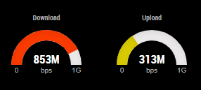

# MMM-SnmpIntSpeed
This a module for [Magic Mirror²](https://github.com/MichMich/MagicMirror).<br />
Queries a network device via SNMP and displays the transfer rates for a single interface.


## Installation
Clone this repository in your modules folder, and install dependencies:

```
cd /path/to/magicmirror/modules
git clone https://github.com/irsheep/MMM-SnmpIntSpeed.git
cd MMM-SnmpIntSpeed
npm install
```

## Configuration
Edit <strong>config.js</strong> located in the <strong>/config</strong> directory of MagicMirror root.
Add the module to your modules array in the MagicMirror configuration file.

```
{
  module: "MMM-SnmpIntSpeed",
  position: "top_left",
  config: {
    gaugeType: 'minimal',
    interval: 5,
    community: 'public',
    version: 2,
    host: "localhost",
    index: 1
  }
},
```

## Module configuration
Here is the documentation of options for the modules configuration:

<table>
  <thead>
    <tr>
      <th>Option</th>
      <th>Description</th>
    </tr>
  </thead>
  <tbody>
    <tr>
      <td><code>customStyle</code></td>
      <td>
        Relative path and name of a custom CSS file. See the <code>styling</code> section below for more information<br />
        <br />
        <strong>Default: </strong><br />
        <strong>Type: </strong> <code>string</code><br />
        <strong>Possible values: </strong>
      </td>
    </tr>    
    <tr>
      <td><code>gaugeType</code></td>
      <td>
        Display as black and white or colour gauge<br />
        <br />
        <strong>Default: </strong><code>minimal</code><br />
        <strong>Type: </strong> <code>string</code><br />
        <strong>Possible values: </strong><br />
        <code>minimal</code> - Black and white<br />
        <code>full</code> - Full gauge with colours
      </td>
    </tr>    
    <tr>
      <td><code>snmpCommunity</code></td>
      <td>
        The SNMP community as configured on the network device<br />
        <br />
        <strong>Default: </strong><code>public</code><br />
        <strong>Type: </strong> <code>string</code><br />
        <strong>Possible values:</strong>
      </td>
    </tr>
    <tr>
      <td><code>version</code></td>
      <td>
        The SNMP protocol version used to connect to the network device.<br />
        <br />
        <strong>Default: </strong><code>2</code><br />
        <strong>Type: </strong> <code>number</code><br />
        <strong>Possible values: </strong><br />
        <code>1</code> - SNMP version 1 <br />
        <code>2</code> - SNMP verson 2c
      </td>
    </tr>    
    <tr>
      <td><code>interval</code></td>
      <td>
        Number of seconds to wait between pools<br />
        <br />
        <strong>Default: </strong><code>5</code><br />
        <strong>Type: </strong> <code>number</code><br />
        <strong>Possible values:</strong>
      </td>
    </tr>
    <tr>
      <td><code>host</code></td>
      <td>
        IP address or hostname of the network device to be pooled<br />
        <br />
        <strong>Default: </strong><code>localhost</code><br />
        <strong>Type: </strong> <code>string</code><br />
        <strong>Possible values:</strong>
      </td>
    </tr>
    <tr>
      <td><code>index</code></td>
      <td>
        The index of the interface in the SNMP tree to be pooled. If you don't know the index of the interface you want to pool, then check the <code>Selecting the interface</code> section<br />
        <br />
        <strong>Default: </strong><code>1</code><br />
        <strong>Type: </strong> <code>number</code><br />
        <strong>Possible values:</strong>
      </td>
    </tr>

  </tbody>
</table>

### Styling

Styling using CSS is currently a work in progress and currently is mainly used to facilitate changing the size of the gauges. The example below will change the gauges size from the 150x100 default size to 300x200 pixels in size.

```
#downloadSpeedGauge, #uploadSpeedGauge{
  width:300px; height:200px;
}
```

### Selecting the interface

With the main MagicMirror module, there is also an independent application that can be used to find the index of the interface to pool. <br />
The application can be run without any arguments and in this case will read MagicMirror <b>config.js</b> look for the MMM-SnmpIntSpeed configuration and use it to pool the device, this is useful to verify that this module is properly configured in MagicMirror.
```
node GetInterfaces.js
```

Depending on the device being pooled it will output something like below, which is from a PfSense Firewall.
```
{
  '1': { ifDescr: 'em0', ifName: 'em0', ifAlias: 'Outside' },
  '2': { ifDescr: 'em1', ifName: 'em1', ifAlias: 'Inside' },
  '3': { ifDescr: 'enc0', ifName: 'enc0', ifAlias: '' },
  '4': { ifDescr: 'lo0', ifName: 'lo0', ifAlias: '' },
  '5': { ifDescr: 'pflog0', ifName: 'pflog0', ifAlias: '' },
  '6': { ifDescr: 'pfsync0', ifName: 'pfsync0', ifAlias: '' }
}
```

If the module wasn't yet configured, then you will need to pass the correct SNMP version, community and IP or hostname of the device.
```
node GetInterfaces.js --version 2 --community public --host 127.0.0.1
```

## Screenshots

Using the minimal display<br />


Using the full display<br />


## License
### The MIT License (MIT)

Copyright © 2019 Luis Tavares

Permission is hereby granted, free of charge, to any person obtaining a copy of this software and associated documentation files (the “Software”), to deal in the Software without restriction, including without limitation the rights to use, copy, modify, merge, publish, distribute, sublicense, and/or sell copies of the Software, and to permit persons to whom the Software is furnished to do so, subject to the following conditions:

The above copyright notice and this permission notice shall be included in all copies or substantial portions of the Software.

The software is provided “as is”, without warranty of any kind, express or implied, including but not limited to the warranties of merchantability, fitness for a particular purpose and noninfringement. In no event shall the authors or copyright holders be liable for any claim, damages or other liability, whether in an action of contract, tort or otherwise, arising from, out of or in connection with the software or the use or other dealings in the software.
